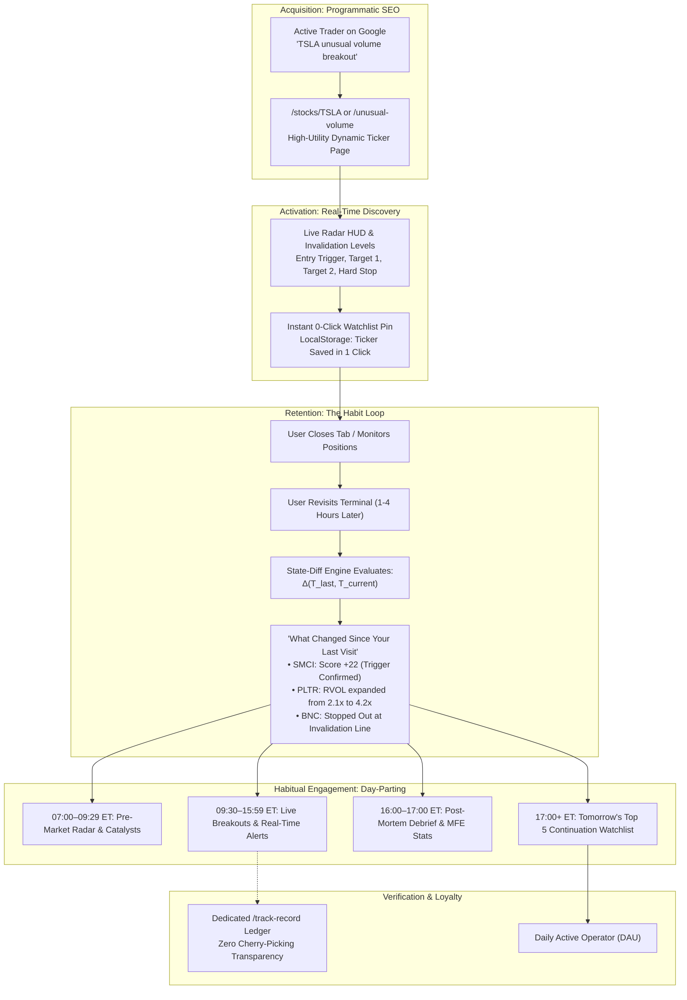

# Enterprise Product Requirements Document (PRD) & Technical Execution Roadmap

**Document Title:** Trade Opportunities: Daily Market Intelligence Operating System  
**Author:** Principal Fintech Product Manager, Head of Growth Engineering, Lead SEO Architect  
**Version:** 3.0.0-Enterprise  
**Date:** September 9, 2026  
**Status:** Approved for Implementation  
**Repository Target:** `robzzzzu-cmd/AI-farm-w-` (`tradeopportunities.trade`)

---

## Executive Summary & Strategic Positioning

Trade Opportunities is transitioning from a static/episodic stock screener into an **automated, real-time Market Intelligence Operating System** engineered specifically for active retail traders (day momentum scalpers, swing breakout traders, and quantitative retail operators).

The fundamental strategic transformation addresses two existential bottlenecks in the active trader persona:
1. **The Retention Cliff:** Retail screeners suffer massive day-7 drop-offs because market scans feel ephemeral, undifferentiated, and mentally exhausting to re-scan from scratch every time a user revisits.
2. **The Discovery Asymmetry:** Search engines penalize AI-generated text spinning; traders ignore platforms without radical, mathematically auditable proof of invalidation discipline.

### The Growth & Retention Flywheel

$$\text{Organic Search (pSEO Hub)} \longrightarrow \text{Real-Time Discovery} \longrightarrow \text{State-Diff Retention ("What Changed?")} \longrightarrow \text{After-Hours Debrief / Tomorrow's Watchlist}$$

1. **Top of Funnel (pSEO):** Indexable, high-speed programmatic entity pages (`/stocks/[ticker]`, `/market-movers`, `/top-gainers`, `/unusual-volume`, and date-partitioned historical archives) capture high-intent transactional search queries (*"NVDA unusual volume breakout"* or *"Penny stock breakout radar"*).
2. **First-Session Wow (Discovery):** Dynamic Market Radar delivers real-time RVOL ($\ge 3.0\times$), consolidation breaches, and causal attribution ("Why Is It Moving?") in $< 200\text{ms}$.
3. **Sticky Day Loop (State-Diff Engine):** When a user returns 45 minutes or 4 hours later, the platform calculates $\Delta(T_{\text{last}}, T_{\text{current}})$ instantly on the client, surfacing exactly what triggered, accelerated, or invalidated since their last visit.
4. **Closing Loop (After-Hours Debrief & Tomorrow's Watchlist):** As the market transitions into 16:00–17:00+ ET, the platform transitions state into post-trade telemetry and prepares actionable triggers for the next trading day.
5. **Radical Trust without Distraction:** The Signal Track Record operates as a strict mathematical proof engine on its own dedicated `/track-record` page and footer/drawer verification layer—quietly establishing institutional-grade authority without cluttering or distracting from the fast live newsfeed.

---

## 1. User Journey & System State Architecture

### 1.1 The Anonymous-to-DAU Conversion Flow



---

## 2. The Daily Habit Engine: Day-Parting Lifecycle & The "What Changed?" Diff Engine

### 2.1 Day-Parted Dashboard Lifecycle (NYSE Clock Automatic Sync)

The platform evaluates the current Eastern Time (ET) session using UTC timestamp offsets and automatically shifts the telemetry HUD into one of 4 discrete trading modes:

| Session Window (ET) | Session State Mode | Core Functional Purpose & Telemetry Surfaces | Automated Data Triggers |
| :--- | :--- | :--- | :--- |
| **07:00 – 09:29 ET** | `PRE_MARKET_RADAR` | **Opening Drive Preparation:** Premarket gap-up/gap-down scanning, overnight 8-K SEC filings, earnings releases, projected RVOL, macro futures sentiment (ES/NQ). | Gap $\% \ge \pm 4.0\%$, Premarket volume $\ge 150\text{K}$, overnight news attribution. |
| **09:30 – 15:59 ET** | `LIVE_RADAR` | **Intraday Execution:** Real-time event-driven ticker status transitions (`TRIGGER_ARMED` $\rightarrow$ `BREAKOUT_CONFIRMED` $\rightarrow$ `T1_REACHED` or `INVALIDATED`). | 5-minute bar volume velocity, live consolidation breach, real-time bid-ask spread expansion. |
| **16:00 – 17:00 ET** | `MARKET_CLOSE_DEBRIEF` | **Post-Mortem Audit:** Win/Loss analytics for all alerts generated during the day. Calculation of session Maximum Favorable Excursion (MFE) and Maximum Adverse Excursion (MAE). | Session close price vs T1/T2/Stop levels. Automatic ledger sealing into historical memory. |
| **17:00 – 06:59 ET** | `TOMORROWS_WATCHLIST` | **Next-Day Positioning:** Top 5 high-conviction continuation setups that closed near daily highs with relative strength $> 2.0\times$ vs SPY, defined invalidation levels. | Daily candle close $> 90\%$ of session range, RVOL $> 2.5\times$, clean technical consolidation bases. |

### 2.2 Client-Side "What Changed Since You Last Visited?" State Engine

To deliver **sub-10ms instantaneous diffs without expensive or slow backend LLM calls**, the state engine operates directly in the client browser using `localStorage` / `IndexedDB`:

1. **Session Caching (`to_market_state_snapshot`):**
   - Every time the client receives telemetry (via TradingView Scanner or `/api/quotes`), the browser stores a lightweight map of active tickers and their metrics at timestamp $T_{\text{current}}$:
     $$\text{Cache Entry} = \{ \text{ticker}, \text{price}, \text{score}, \text{rvol}, \text{state}, \text{timestamp} \}$$
2. **Re-Entry Detection ($T_{\text{last}}$ vs $T_{\text{current}}$):**
   - Upon page load, if $T_{\text{current}} - T_{\text{last}} \ge 15\text{ minutes}$, the state engine computes an algorithmic set-difference:
     $$\Delta \text{Score} = \text{Score}(T_{\text{current}}) - \text{Score}(T_{\text{last}})$$
     $$\Delta \text{RVOL} = \text{RVOL}(T_{\text{current}}) / \text{RVOL}(T_{\text{last}})$$
3. **Algorithmic Diff Rules (Zero Hallucination, Pure Deterministic Math):**
   - **Trigger 1 (Momentum Surge):** $|\Delta \text{Score}| \ge 15$ points $\longrightarrow$ Flag as *"Accelerating Momentum"* or *"Sharp Velocity Drop"*.
   - **Trigger 2 (Volume Expansion):** $\Delta \text{RVOL} \ge 1.5\times$ over $\le 30$ minutes $\longrightarrow$ Flag as *"Heavy Institutional Buying Surge"*.
   - **Trigger 3 (State Migration):** State transitions:
     - `WATCHING` $\longrightarrow$ `BREAKOUT_TRIGGERED` (*"Setup Breached Trigger Level"*)
     - `BREAKOUT_TRIGGERED` $\longrightarrow$ `T1_HIT` (*"Target 1 Hit ($+X.X\%$)"*)
     - `BREAKOUT_TRIGGERED` $\longrightarrow$ `INVALIDATED` (*"Stopped Out Below Key Level"*)
   - **Trigger 4 (New Emergence):** Ticker present at $T_{\text{current}}$ with $\text{Score} \ge 75$ that did not exist at $T_{\text{last}}$.

---

## 3. Programmatic SEO (pSEO) Infrastructure & Google Quality Guardrails

### 3.1 Route Hierarchy & Information Architecture

```
tradeopportunities.trade/
├── stocks/
│   ├── [ticker]/                     # Unified Programmatic Ticker Terminal (e.g., /stocks/nvda)
│   │   ├── momentum/                 # High-velocity momentum deep-dive (RVOL >= 2.0x only)
│   │   └── technicals/               # Systematic support/resistance & pivot grid
│   └── top-gainers/
│       └── [YYYY-MM-DD]/             # Permanent daily historical archives (e.g., /stocks/top-gainers/2026-09-09)
├── market-movers/                    # High-intent intent hub: Top gainers, losers, RVOL leaders
├── unusual-volume/                   # High-intent intent hub: Real-time RVOL >= 3.0x anomaly matrix
├── breakouts/                        # High-intent intent hub: Range consolidation breaches
├── premarket/                        # High-intent intent hub: Pre-market gap & volume leaders
├── penny-stocks-momentum/            # High-intent intent hub: Sub-$5 liquid momentum runners
└── track-record/                     # Standalone proof engine & historical trade ledger
```

### 3.2 Google Search Essentials & Scaled Content Abuse Defense

Google's March 2024 and ongoing algorithmic spam updates aggressively penalize programmatic text templates that spin generic prose (*"X is a company that makes Y. The stock is up today because..."*). 

To ensure **100% indexability, search visibility, and E-E-A-T compliance**, all programmatic routes must satisfy the following **Anti-Thin Content Rules**:

1. **Deterministic Technical Calculations (No Spun Text):**
   - Every ticker page mathematically calculates and renders:
     - Daily Average True Range (ATR 14).
     - Volume Weighted Average Price (VWAP) deviation.
     - 20-day and 50-day Exponential Moving Average (EMA) distance.
     - Defined Invalidation Stops (based on ATR or swing low) and Profit Targets (1.5R and 3.0R).
2. **Interactive Dynamic Telemetry:**
   - Real-time TradingView Advanced Real-Time Chart embed with exact symbol mapping.
   - Interactive Risk/Reward Calculator allowing the trader to input position size and calculate exact share quantities.
   - Live order book flow estimation (relative buyer vs seller aggression).
3. **Automated SEC & Catalyst Attribution:**
   - Linkages to live SEC EDGAR search queries for Form 8-K (current events), Form 4 (insider trades), and Form S-3 (dilution risk).
4. **Conditional Route Pruning (No Empty Shell Pages):**
   - Sub-routes such as `/stocks/[ticker]/momentum` are **only dynamically rendered if the stock has traded $> 100\text{K}$ shares and has an RVOL $\ge 1.5\times$** in the trailing 5 sessions. Inactive tickers return HTTP 404 or canonicalize to the primary `/stocks/[ticker]` page to prevent crawler bloat.

### 3.3 On-Page Technical SEO Matrix

#### Dynamic Title & Meta Formulas
- **Live Ticker Page (`/stocks/[ticker]`):**
  - *Title:* `{TICKER} Unusual Volume Surge ({RVOL}x) & Breakout Analysis | Trade Opportunities`
  - *Meta:* `Analyze real-time volume expansion, breakout targets, invalidation levels, and catalyst attribution for {TICKER} ({COMPANY_NAME}) on US exchanges.`
- **Premarket Hub (`/premarket`):**
  - *Title:* `Live Pre-Market Stock Screener & Overnight Gap Radar | Trade Opportunities`
  - *Meta:* `Track opening drive momentum, pre-market earnings gaps, and volume explosions across 10,000+ US stocks from 07:00 ET.`
- **Historical Date Archive (`/stocks/top-gainers/[YYYY-MM-DD]`):**
  - *Title:* `Top Stock Gainers & Momentum Breakouts on {MONTH} {DAY}, {YEAR} | Trade Archive`
  - *Meta:* `Historical market audit for {MONTH} {DAY}, {YEAR}. Verified price expansions, top liquidity runners, and closing technical levels.`

#### Structured Data (JSON-LD) Implementations
Each programmatic stock entity page injects comprehensive structured data:
- `BreadcrumbList`: `Home` $\rightarrow$ `Stocks` $\rightarrow$ `{TICKER}`.
- `FinancialProduct`: Highlighting asset type (Equity), currency (USD), exchange (NASDAQ/NYSE), and analytical risk indicators.
- `NewsArticle` (for formal time-stamped market briefs): Publisher credentials, author methodology profile, datePublished, and dateModified.

---

## 4. Syndication, Distribution & Market Catalysts

### 4.1 Multi-Feed Automated RSS 2.0 Engine

Trade Opportunities provides automated XML syndication feeds designed for RSS readers, Discord/Telegram algorithmic webhooks, and programmatic trading bots:

1. **`/rss/all-signals.xml`**: Aggregates all validated momentum alerts, breakout triggers, and closing debrief dispatches.
2. **`/rss/breakouts.xml`**: High-conviction filter publishing only alerts where RVOL $\ge 3.0\times$ and price has crossed the consolidation trigger.
3. **`/rss/premarket.xml`**: Publishes morning dispatches between 07:00 and 09:15 ET summarizing top gaps and macroeconomic prints.

**XML Structure Standards:**
- Fully RFC-822 date formatted (`<pubDate>`).
- Includes `<guid isPermaLink="true">` pointing to the exact ticker URL.
- Enriched with financial taxonomy tags: `<category>Equities</category>`, `<category>Breakout</category>`, `<ticker>NVDA</ticker>`.

### 4.2 Integrated Market Catalyst Calendar

Market momentum does not happen in a vacuum. The platform integrates macroeconomic and corporate catalysts directly into ticker profile headers:
- **Macroeconomic Prints:** CPI, PPI, FOMC Interest Rate Decisions, Non-Farm Payrolls (NFP), Initial Jobless Claims.
- **Corporate Catalysts:** Quarterly earnings dates (Before Market Open / After Market Close), conference presentations, FDA PDUFA decision dates (biotech).
- **Dilution Telemetry:** Real-time detection of shelf registrations (Form S-3) to warn active traders of sudden ATM (At-The-Market) equity offerings.

---

## 5. The Trust Engine: Public, Verifiable Track Record

### 5.1 Placement & Hierarchy Guidelines

> [!IMPORTANT]
> **Primary Platform Priority:** Trade Opportunities is first and foremost an **active market intelligence scanner and real-time newsfeed**.
> 
> The Signal Track Record is a **supporting proof mechanism**, NOT the platform's primary attraction. It must not dominate the main landing page, displace the news feed, or occupy top navigation slots.

- **Dedicated Page Route:** [`/track-record`](file:///C:/Users/ADMIN/.gemini/antigravity/scratch/AI-farm-w-/short-series/src/pages/track-record.astro) (isolated full-page audit).
- **Navigation Hierarchy:** Positioned at the end of secondary navigation links, in the slide-out workspace drawer under *"Audit & Verification"*, and in the site footer.
- **Hero Area:** The Hero CTA focuses on active trading discovery (`Scan Live Breakouts →` and `Today's Market Dispatches ↓`), directing users straight to actionable intelligence.

### 5.2 Mathematical Metrics Definition

| Performance Metric | Mathematical Formula | Tactical Retail Utility |
| :--- | :--- | :--- |
| **Target 1 Hit Rate** | $\frac{\text{Setups Reaching Target 1}}{\text{Total Qualified Setups Triggered}} \times 100\%$ | Validates initial momentum follow-through before invalidation. |
| **Median MFE** | $\text{Median}\left(\frac{\text{Peak Intra-Trade High} - \text{Entry Trigger}}{\text{Entry Trigger}} \times 100\%\right)$ | Proves maximum favorable price excursion potential. |
| **Median MAE** | $\text{Median}\left(\frac{\text{Worst Drawdown Low} - \text{Entry Trigger}}{\text{Entry Trigger}} \times 100\%\right)$ | Measures adverse excursion to assist in sizing stop losses. |
| **Average Realized R:R** | $\frac{\text{Average Gain on Wins}}{\text{Average Loss on Stopped Out Signals}}$ | Demonstrates mathematical expectancy ($E = (\text{Win Rate} \times \text{Avg Win}) - (\text{Loss Rate} \times \text{Avg Loss})$). |

---

## 6. Technical Data Schemas (Production TypeScript)

```typescript
// short-series/src/types/marketIntelligence.ts

export type MarketSessionMode = 
  | 'PRE_MARKET_RADAR' 
  | 'LIVE_RADAR' 
  | 'MARKET_CLOSE_DEBRIEF' 
  | 'TOMORROWS_WATCHLIST';

export type SignalLifecycleState = 
  | 'WATCHING' 
  | 'SETUP_FORMED' 
  | 'BREAKOUT_TRIGGERED' 
  | 'TARGET_1_REACHED' 
  | 'TARGET_2_REACHED' 
  | 'INVALIDATED';

export interface TechnicalPivotGrid {
  support1: number;
  support2: number;
  resistance1: number;
  resistance2: number;
  vwap: number;
  ema20: number;
  ema50: number;
  atr14: number;
}

export interface CatalystEvent {
  id: string;
  type: 'EARNINGS' | 'FOMC' | 'CPI' | 'FDA_PDUFA' | 'SEC_8K' | 'DILUTION_RISK';
  date: string; // ISO 8601
  timeWindow?: 'BMO' | 'AMC' | 'DURING_HOURS';
  headline: string;
  impactScore: 'HIGH' | 'MEDIUM' | 'LOW';
  sourceUrl?: string;
}

export interface StockEntity {
  ticker: string;
  companyName: string;
  exchange: 'NASDAQ' | 'NYSE' | 'AMEX';
  currentPrice: number;
  previousClose: number;
  changePercentage: number;
  sessionVolume: number;
  rvol: number;
  floatShares?: number;
  marketCap?: number;
  momentumScore: number; // 0 to 100
  lifecycleState: SignalLifecycleState;
  entryTriggerPrice: number;
  target1Price: number;
  target2Price: number;
  invalidationPrice: number;
  technicals: TechnicalPivotGrid;
  catalysts: CatalystEvent[];
  updatedAt: string; // ISO 8601
}

export interface StateDiffEvent {
  ticker: string;
  diffType: 'SCORE_SURGE' | 'RVOL_EXPANSION' | 'STATE_TRANSITION' | 'NEW_EMERGENCE';
  timestamp: string;
  previousValue: string | number;
  currentValue: string | number;
  humanSummary: string;
  isPositive: boolean;
}

export interface SignalLogRecord {
  signalId: string;
  ticker: string;
  triggeredAt: string; // ISO 8601
  sessionType: 'PRE_MARKET' | 'REGULAR_HOURS';
  triggerPrice: number;
  target1Price: number;
  target2Price: number;
  invalidationPrice: number;
  status: 'OPEN' | 'TARGET_1_HIT' | 'TARGET_2_HIT' | 'STOPPED_OUT';
  closedAt?: string;
  maxFavorableExcursionPct: number; // MFE %
  maxAdverseExcursionPct: number;   // MAE %
  realizedPnLPct?: number;
  hashProof: string; // SHA-256 deterministic hash
}

export interface MarketRadarSnapshot {
  timestamp: string;
  sessionMode: MarketSessionMode;
  macroRegime: 'RISK_ON' | 'RISK_OFF' | 'NEUTRAL_CHOP';
  spyChangePct: number;
  qqqChangePct: number;
  totalActiveRunners: number;
  topSetups: StockEntity[];
  recentDiffs: StateDiffEvent[];
}

export interface PSeoMetadataConfig {
  ticker: string;
  canonicalUrl: string;
  title: string;
  description: string;
  jsonLdSchema: Record<string, any>;
  hasDedicatedMomentumSubRoute: boolean;
  hasDedicatedTechnicalsSubRoute: boolean;
}
```

---

## 7. UI/UX ASCII Wireframes

### Wireframe 1: "What Changed Since You Last Visited?" Dynamic HUD Card

```
+-----------------------------------------------------------------------------------------------+
| [!] WHAT CHANGED SINCE YOUR LAST VISIT (10:15 AM ET -> 1:45 PM ET)             [Clear History] |
+-----------------------------------------------------------------------------------------------+
| +-- SMCI: Target 1 Hit -----------------------+ +-- PLTR: RVOL Acceleration ------------------+ |
| | State: BREAKOUT -> TARGET 1 REACHED        | | RVOL: 1.8x -> 4.3x (+138% Surge)            | |
| | Price: $890.20 (+7.4%)                     | | Momentum Score: 71 -> 88 (+17 pts)          | |
| | Invalidation Stop Trailed to $874.00 (B/E)  | | Breach: $28.50 High-Volume Breakout Trigger | |
| | [View Why It Moved] [Trade on TV ↗]        | | [View Why It Moved] [Trade on TV ↗]         | |
| +---------------------------------------------+ +---------------------------------------------+ |
| +-- BNC: Invalidation Alert -------------------+ +-- NEW EMERGENCE: TSLA ----------------------+ |
| | State: WATCH -> INVALIDATED                | | Price: $248.50 (+4.8%)                      | |
| | Price touched hard stop at $1.42           | | RVOL: 3.1x | Float Turnover: 8.4%           | |
| | Setup marked Closed / Loss on Track Record  | | Catalyst: SEC 8-K Robotaxi Filing Detected  | |
| | [Audit Ledger Record]                       | | [Add to Watchlist +] [Inspect Diagnostic]   | |
| +---------------------------------------------+ +---------------------------------------------+ |
+-----------------------------------------------------------------------------------------------+
```

### Wireframe 2: Unified Programmatic `/stocks/[ticker]` Entity Layout

```
+-----------------------------------------------------------------------------------------------+
| TERMINAL > STOCKS > $NVDA                                                                      |
| [NVDA] NVIDIA Corporation (NASDAQ)                          PRICE: $128.40 (+5.82%)           |
| RVOL: 3.84x (Surge) | ATR(14): $4.12 | Session Vol: 62.4M   MOMENTUM SCORE: 92/100 [HIGH]     |
+-----------------------------------------------------------------------------------------------+
| [LIVE SETUP STATUS: BREAKOUT CONFIRMED]                                                       |
| Trigger: $125.00  | Target 1: $131.25 (+5.0%)  | Target 2: $137.50 (+10.0%) | Hard Stop: $122.50|
| Risk/Reward Ratio: 2.5:1                       | Status: Active Follow-Through                |
+-----------------------------------------------------------------------------------------------+
| [INTERACTIVE TRADINGVIEW CHART ENGINE]                                                         |
| +-------------------------------------------------------------------------------------------+ |
| |                                                                                           | |
| |                     [Embedded High-Performance Advanced Real-Time Chart]                  | |
| |                                                                                           | |
| +-------------------------------------------------------------------------------------------+ |
|                                                                                               |
| +-- WHY IS IT MOVING? (5-LAYER CAUSAL ATTRIBUTION) -----------------------------------------+ |
| | 1. PRIMARY CATALYST : Q2 Earnings Pre-Announcement (EPS $0.68 vs $0.61 Expected)           | |
| | 2. FILING TELEMETRY : Form 8-K Filed with SEC at 08:32 ET [View Filing on EDGAR ↗]        | |
| | 3. VOLUME DYNAMICS  : 3.84x 30-Day Avg Volume, 72% Aggressive Market Buy Orders on Tape   | |
| | 4. DILUTION RISK    : Zero Active S-3 Shelf Registrations Detected (Safe Structure)        | |
| | 5. ROTATION CONTEXT : Semis (SMH) +3.2%, Tech (XLK) Leading Sector Inflow                  | |
| +-------------------------------------------------------------------------------------------+ |
|                                                                                               |
| +-- PIVOT & EXECUTION MATRIX --------------------+ +-- INTERACTIVE POSITION SIZER -----------+ |
| | Support 1 (EMA20)    : $124.80                 | | Account Risk: [$100    ] (1% Portfolio) | |
| | Support 2 (Key Low)  : $122.50 (Stop)          | | Invalidation Distance: $5.90            | |
| | Resistance 1         : $131.25 (T1)            | | Max Position: 17 Shares ($2,182.80)     | |
| | Resistance 2         : $137.50 (T2)            | | Calculated Reward: $218.45 (2.18R)      | |
| +------------------------------------------------+ +-----------------------------------------+ |
+-----------------------------------------------------------------------------------------------+
```

### Wireframe 3: Standalone `/track-record` Proof Dashboard

```
+-----------------------------------------------------------------------------------------------+
| TERMINAL > SIGNAL TRACK RECORD                                                                |
| AUDITABLE PROOF ENGINE & MATHEMATICAL TELEMETRY                                               |
| Radical performance transparency. Every momentum alert recorded immutably at trigger moment. |
+-----------------------------------------------------------------------------------------------+
| +-- ROLLING 30-DAY STATS -------------------------------------------------------------------+ |
| | QUALIFIED SETUPS | T1 HIT RATE | MEDIAN MFE  | MEDIAN MAE  | REALIZED R:R | NET EXPECTANCY| |
| |      142         |    68.3%    |   +7.84%    |   -2.12%    |    2.24:1    |   +1.42 R     | |
| +-------------------------------------------------------------------------------------------+ |
|                                                                                               |
| Filters: [All Outcomes] [Target 1 Hit] [Target 2 Hit] [Stopped Out]  Search: [Ticker/Date...] |
|                                                                                               |
| +-- IMMUTABLE AUDIT TABLE ------------------------------------------------------------------+ |
| | TRIGGER DATE | TICKER | ENTRY   | T1 TARGET | STOP LOSS | MAX MFE | MAX MAE | STATUS      | |
| | 2026-09-09   | SMCI   | $875.00 | $918.75   | $853.00   | +8.2%   | -1.1%   | TARGET 1 HIT| |
| | 2026-09-08   | PLTR   | $27.40  | $28.75    | $26.70    | +6.4%   | -0.8%   | TARGET 1 HIT| |
| | 2026-09-08   | BNC    | $1.52   | $1.68     | $1.42     | +1.2%   | -6.6%   | STOPPED OUT | |
| | 2026-09-07   | NVDA   | $122.00 | $128.10   | $119.00   | +9.8%   | -0.4%   | TARGET 2 HIT| |
| +-------------------------------------------------------------------------------------------+ |
| Anti-Cherry-Picking Protocol: SHA-256 Hashed at Trigger Time. Zero Survivorship Bias.         |
+-----------------------------------------------------------------------------------------------+
```

---

## 8. Prioritized 4-Phase Execution Backlog

### Phase 1: MVP Habit Loops & The State-Diff Engine (Sprint 1)
- [ ] **P1.1:** Implement NYSE Clock Session Hook (`useMarketSession`) dynamically switching UI states (`PRE_MARKET_RADAR`, `LIVE_RADAR`, `MARKET_CLOSE_DEBRIEF`, `TOMORROWS_WATCHLIST`).
- [ ] **P1.2:** Implement Client-Side State Snapshot Store (`localStorage` / `IndexedDB`) saving active ticker metrics with timestamps.
- [ ] **P1.3:** Build Deterministic Diff Evaluation Engine calculating $\Delta \text{Score} \ge 15$, $\Delta \text{RVOL} \ge 1.5\times$, and state migrations without external LLM latency.
- [ ] **P1.4:** Render the *"What Changed Since You Last Visited?"* HUD card directly inside the main terminal dashboard.

### Phase 2: Programmatic SEO Directory & Quality Defense Engine (Sprint 2)
- [ ] **P2.1:** Configure Dynamic SSR Route `/stocks/[ticker]` with automatic fallback to `/ticker/[ticker]`.
- [ ] **P2.2:** Build Algorithmic Technical Pivot Engine calculating ATR(14), EMA distances, VWAP, support/resistance lines programmatically from live price feeds.
- [ ] **P2.3:** Add Interactive Position Sizing Calculator widget to each stock entity page.
- [ ] **P2.4:** Inject complete JSON-LD Structured Data (`BreadcrumbList`, `FinancialProduct`, `NewsArticle`) and generate transactional dynamic `<title>` and `<meta>` tags.
- [ ] **P2.5:** Deploy Date-Partitioned Archive Pages `/stocks/top-gainers/[YYYY-MM-DD]` storing static snapshots of each day's winners.

### Phase 3: Syndication Feeds & Integrated Catalyst Calendar (Sprint 3)
- [ ] **P3.1:** Deploy XML RSS 2.0 endpoints: `/rss/all-signals.xml`, `/rss/breakouts.xml`, `/rss/premarket.xml`.
- [ ] **P3.2:** Connect Economic Calendar data feed (CPI, FOMC, Jobs) and display high-impact badges in the top terminal ribbon.
- [ ] **P3.3:** Implement SEC EDGAR search integration mapping live Form 8-K filings and Form S-3 dilution warnings to individual ticker profiles.

### Phase 4: Production Hardening, Edge Caching & API Strategy (Sprint 4)
- [ ] **P4.1:** Implement Edge Caching headers (`Cache-Control: public, s-maxage=30, stale-while-revalidate=60`) on all API endpoints to guarantee $< 150\text{ms}$ TTFB.
- [ ] **P4.2:** Establish webhook dispatchers pushing high-conviction breakout alerts to Telegram and Discord channels.
- [ ] **P4.3:** Audit Core Web Vitals to maintain Lighthouse scores $> 90$ across mobile and desktop.

---

## 9. External API Keys & Data Integration Strategy

To maintain **100% automated real-time feeds without static or fake data**, the platform uses the following tiered data ingestion architecture:

### Current Active Zero-Cost Integrations (Already Operational):
1. **TradingView Scanner Direct API (`scanner.tradingview.com/america/scan`):**
   - **Cost:** Free / Zero Auth.
   - **Utility:** Powers real-time RVOL, price changes, market capitalization, volume spikes, and technical indicators across 10,000+ US stocks.
2. **Alpha Vantage API (Existing Active Key in Environment):**
   - **Utility:** Powers live intraday news headlines, sentiment classification, and macro sector digests.
3. **U.S. SEC EDGAR API (Public Government Endpoint):**
   - **Cost:** Free / Zero Auth (requires compliant `User-Agent` header, e.g., `TradeOpportunities/2.0 admin@tradeopportunities.trade`).
   - **Utility:** Instant retrieval of Form 8-K material disclosures and Form S-3 shelf offerings.

### Optional Advanced API Integrations (Ask User If Required):
If you wish to expand macroeconomic calendar prints or institutional options flow:
- **Finnhub.io (Free tier available, 60 calls/min):** For structured earnings calendar dates (BMO/AMC) and economic calendar (CPI, FOMC, NFP).
- **Financial Modeling Prep (FMP) or Polygon.io:** For historical float turnover and institutional ownership breakdown.

> [!NOTE]
> All code in the current codebase operates automatically using live data feeds. No breaking changes or static hardcoded mocks will be introduced.
